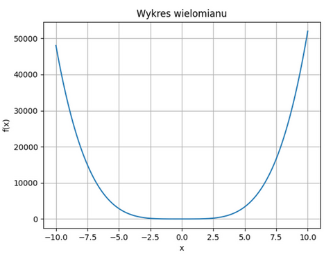

# Zestaw 1

## Zadanie 1
Mamy listę, która może zawierać różne typy, na przykład inną listę, ale również krotkę, słownik, itp.... Dodaj element o kolejnej wartości w najbardziej zagnieżdżonej liście. Poprzez zwiększenie poziomu zagnieżdżenia rozumiemy wejście do kolejnego zagnieżdżenia – listy, krotki, słownika. W słowniku jeśli wartością będzie lista, to jej elementy należy traktować jak jeszcze bardziej zagnieżdżone. Napisz program, który zrobi to uniwersalnie, dla dowolnego zagnieżdżenia.

### Przykład 1
Dla `[1, [2, 3], 4]` mamy `[1, [2, 3, 4], 4]`.

Dla `[3, 4, [2, [1, 2, [7, 8], 3, 4], 3, 4], 5, 6, 7]` powinno być `[3, 4, [2, [1, 2, [7, 8, 9], 3, 4], 3, 4], 5, 6, 7]`.

Jeżeli największe zagnieżdżenie na danym poziomie się powtórzy, należy dodać w obu zagnieżdżeniach, czyli dla `[1, [3], [2], []]` należy uzyskać `[1, [3, 4], [2, 3], [1]]`.

### Przykład 2
Przykład bardziej złożony:

`[1, 2, [3, 4, [5, {'klucz': [5, 6], 'tekst': [1, 2]}], 5], 'hello', 3, [4, 5], (5, (6, (1, [7, 8])))]`.

Tutaj na takim samym, największym poziomie zagnieżdżenia, są listy będące wartościami w słowniku (listy `[5, 6]`, `[1, 2]`) a także zagnieżdżona w krotkach (lista `[7, 8]`) i do to do nich powinien zostać dodany kolejny element. Zatem oczekiwane jest:

`[1, 2, [3, 4, [5, {'klucz': [5, 6, 7], 'tekst': [1, 2, 3]}], 5], 'hello', 3, [4, 5, 6], (5, [6, [7, 8, 9]])]`.

**Wymagania formalne** Użyć plik `zadanie_1/zadanie1.py` w repozytorium GitHub Classroom do uzupełnienia swoim kodem. Nie zmieniać nazwy funkcji. Testowane będzie działanie funkcji `dodaj_element(wejscie)`, która zwraca „wyjście” zmodyfikowane jak powyżej opisano:
* wejście: `[[], [[], []]]` wyjście: `[[], [[1], [1]]]`
* wejście: `[1, 2, 3, 4]` wyjście: `[1, 2, 3, 4, 5]`

## Zadanie 2

Dla dowolnego podanego łańcucha znakowego wypisać: ile jest w nim słów, ile liter, ile cyfr. Konwencja: słowo to litera lub więcej liter, oddzielona białym znakiem lub jakimkolwiek innym znakiem przestankowym, może być sklejone z liczbą, ale jeśli sklejone tak, że liczba w środku, to „aaa123bbb” tworzy jedno słowo, ale trzy cyfry. Liczba osobno napisana to nie słowo. Cyfra to każda cyfra 0..9, liczone są osobno i niezależnie od połączenia.

### Przykłady
* „3-krotny” ma 1 słowo, 1 cyfrę
* „czarno-bialy” ma 2 słowa
* „123krotny” ma 1 słowo i 3 cyfry
* „Macy’s” to dwa słowa
* „jeden2dwa” to jedno słowo i jedna cyfra.

Wypisać statystykę częstości występowania poszczególnych liter oraz cyfr – wypisując w porządku alfabetycznym i tylko te niezerowe. Uwaga: w całym łańcuchu znakowym nie rozróżniamy wielkości liter, czyli 'A' traktujemy tak samo jak 'a'.

W tym zadaniu przydaje się poznanie funkcji `Counter` z modułu `collections` (https://docs.python.org/3/library/collections.html#collections.Counter), przeznaczona do zliczania wystąpień elementów w iterowalnych strukturach, takich jak listy, łańcuchy znaków, czy krotki. `Counter` automatycznie tworzy słownik, w którym kluczami są unikalne elementy, a wartościami są liczby wystąpień tych elementów. Counter doskonale sprawdza się w zliczaniu liter w ciągu tekstowym:

```python
from collections import Counter
tekst = "abrakadabra"
licznik = Counter(tekst)
print(licznik) # Output: Counter({'a': 5, 'b': 2, 'r': 2, 'k': 1, 'd': 1})
print(licznik.most_common(2)) # zwraca np. 2 najczęściej występujące elementy: [('a', 5), ('b', 2)]
```

**Wymagania formalne** Użyć plik `zadaine_2/zadanie2.py` w repozytorium GitHub Classroom do uzupełnienia swoim kodem. Nie zmieniać nazwy funkcji. Testowane będzie działanie funkcji `statystyka_lancucha(tekst)`, która zwraca typ złożony – tak jak podano i opisano w kodzie!

* wejście: "Ala ma 3 koty i 2 psy"; 
* wyjście:
```
Liczba słów: 5
Liczba liter: 13
Liczba cyfr: 2
Statystyka częstości występowania:
'a': 3 'i': 1 'k': 1 'l': 1 'm': 1 'o': 1 'p': 1 's': 1 't': 1 'y': 2 '2': 1 '3': 1
```

## Zadanie 3

Napisać program konwertujący liczby zapisane w systemie rzymskim (wielkimi literami I, V, X, L, C, D, M) na liczby arabskie w zakresie liczb 1-3999, i odwrotnie. Proszę skontrolować poprawność danych wejściowy, również w formacie rzymskim. Proszę spróbować napisać zwięzły kod, np. bez monstrualnych konstrukcji `if`-`else`. Uwaga: kontrolę poprawności danych należy zrealizować z pomocą mechanizmu zgłaszania i obsługi wyjątków. Związana z tym część kodu jest pozostawiona w pliku, który należy pobrać z repozytorium i uzupełnić. W Pythonie wyjątki służą do obsługi błędów, które mogą wystąpić podczas wykonywania programu. Wyjątki umożliwiają reagowanie na różne rodzaje błędów w sposób kontrolowany i precyzyjny, zamiast przerywać program.

* zgłaszanie wyjątku – jeśli w programie napotkamy błąd, możemy zgłosić wyjątek, używając instrukcji `raise`, Przykład:

  ```python
  if not (1 <= liczba <= 3999): raise ValueError("Liczba musi być w zakresie 1-3999")
  ```

* obsługa wyjątków – aby obsłużyć wyjątki i zapobiec przerwaniu działania programu, używamy bloku `try`-`except`. Możemy zdefiniować różne typy wyjątków w sekcji `except`, żeby obsługiwać konkretne błędy. Przykładowo, gdy `rzymskie_na_arabskie("IIII")` zgłosi `ValueError`, wyjątek zostanie przechwycony i wyświetlony komunikat *„Błąd: Niepoprawny format liczby rzymskiej.”*:

  ```python
  try:
      wynik = rzymskie_na_arabskie("IIII") # Niepoprawna liczba rzymska
  except ValueError as e:
      print(f"Błąd: {e}")
  ```

* przechwytywanie i dostęp do treści wyjątku – możemy przechwycić treść wyjątku za pomocą `as`, jak w przykładzie powyżej (`as e`). Pozwala to na odczytanie szczegółów błędu.

* typy wyjątków – Python oferuje wiele wbudowanych wyjątków. Najczęściej używane to:
  - ValueError: gdy wartość ma nieprawidłowy format (np. liczba rzymska "IIII");
  - TypeError: gdy typ danych jest niezgodny (np. dodawanie liczby całkowitej do łańcucha);
  - IndexError: gdy indeks wykracza poza zakres listy.

* obsługa wyjątków w testach – w `pytest` możemy przetestować wyjątki za pomocą `pytest.raises`, co pozwala sprawdzić, czy dany kod zgłasza oczekiwany wyjątek. Przykładowo, blok with `pytest.raises(ValueError):` sprawdza, czy `rzymskie_na_arabskie("ABCD")` zgłasza `ValueError`. Jeśli wyjątek nie zostanie zgłoszony, test zakończy się niepowodzeniem.
  ```python
  import pytest
  def test_konwersja_nieprawidłowe_symbole():
    with pytest.raises(ValueError):
      rzymskie_na_arabskie("ABCD") # Niepoprawne znaki
  ```
 
Uwaga dotycząca konstrukcji `with`: instrukcja `with` w Pythonie jest używana do zarządzania kontekstem, czyli zasobami, które wymagają specjalnego sposobu otwierania i zamykania. Dzięki niej można bezpiecznie pracować z zasobami (np. plikami, połączeniami sieciowymi, blokami kodu z wyjątkami) bez konieczności ręcznego zamykania ich. Gdy tylko kod wewnątrz bloku `with` zostanie wykonany (niezależnie od tego, czy zakończył się pomyślnie, czy przez wyjątek), Python automatycznie wykonuje operacje czyszczące, np. zamyka plik lub kończy połączenie.

**Wymagania formalne** Użyć plik `zadanie_3/zadanie3.py` w repozytorium GitHub Classroom do uzupełnienia swoim kodem. Nie zmieniać nazw funkcji i wykorzystać fragmenty kodu do zgłaszania wyjątków w przypadku niepoprawnych danych. Testowane będzie działanie funkcji `rzymskie_na_arabskie(rzymskie)` i `arabskie_na_rzymskie(arabskie)`, których liczba rzymska jest w postaci łańcucha znakowego `str`, a liczba arabska w postaci typu `int`.
* wejście: `rzymskie_na_arabskie("MCMXCIV")` wyjście: `1994`
* wejście: `arabskie_na_rzymskie(1994)` wyjście: `MCMXCIV`


## Zadanie 4

Mamy liczbę naturalną N w zapisie binarnym (czyli składa się tylko z 0 i 1). Binarna przerwa to sekwencja zer otoczonych z lewej i z prawej strony 1. Na przykład liczba 9 (decymalnie) binarnie wynosi 1001 i posiada jedną binarną przerwę długości 2. Liczba 529 ma binarną reprezentację 1000010001, zatem ma dwie binarne przerwy, o długości 4 i 3. Liczba 20 ma reprezentację 10100 zawiera zatem jedną binarną przerwę o długości 1. Liczba 15 ma reprezentację 1111, a zatem żadnej binarnej przerwy.

Napisz funkcję: `def fun(n)`, która dla podanej liczby naturalnej N (uwaga: liczby w systemie dziesiętnym) zwraca długość jej najdłuższej binarnej przerwy, albo 0, jeśli nie ma ani jednej przerwy. Należy przyjąć, że argument N może być z przedziału [1..2147483647].

*Wskazówka*: warto skorzystać z operatora przesunięcia bitowego `>>`. Warto podejrzeć jak wygląda liczba w zapisie binarnym poprzez rzutowanie `bin(N)`, na przykład, `N = 1041`, binarnie wynosi `10000010001`.

**Wymagania formalne** Użyć plik `zadanie_4/zadanie4.py` w repozytorium GitHub Classroom do uzupełnienia swoim kodem. Nie zmieniać nazwy funkcji. Testowane będzie działanie funkcji `fun(n)`, która zwraca wartość naturalną.
* wejście: N = 1041 wyjście: 5

### Zadanie 5

Python jest językiem, w którym przy użyciu kodu o niewielkiej długości, ale z umiejętnym użyciem bibliotek, da się osiągnąć interesujące wyniki. Celem zadania jest użycie biblioteki do rysowania (`matplotlib`) oraz biblioteki `numpy`. 

Zadanie: napisać prosty program, który pozwoli na podanie wielomianu funkcji `f(x)` jako danej wejściowej (łańcuch znakowy) oraz przedział `x` (od `x_min`, do `x_max`). Narysować ten wielomian za pomocą `plt.plot(x_val, y_val)` (gdzie `x_val` i `y_val` to będą, odpowiednio, tablica wygenerowana za pomocą `x_val = np.linspace(x_min, x_max, 200)`, a tablica `y_val` wyliczona z użyciem funkcji `eval()` dla wartości z tablicy `x_val`. Przykładowo, jeśli wpiszę na wejściu: `5*x**4 + 2*x**3 - x + 6` i podam `-10, 10`, to otrzymam:

<p align="center">
  
</p>

Proszę, tak jak na rysunku przykładowym, dodać podpis osi X i Y, jakiś tytuł, oraz aktywować „grid lines”. Uwaga: **program** ma czytać i dekomponować dane wejściowe podane przez `input()` w formacie: najpierw przepis funkcji f(x), następnie przecinek i dwie wartości będące przedziałem x oddzielone spacją, czyli przykładowo: `x**3 + 3*x + 1, -10 10`. Natomiast sprawdzana w testach będzie krotka z dwiema skrajnymi wartościami danej funkcji, czyli w tym przykładzie `(f(-10), f(10))`, czyli `(-1029.0, 1031.0)`.

Funkcja `eval()` jest potencjalnie niebezpieczna, poza tym ma ograniczone możliwości parsowania. Zatem jako uzupełnienie do powyższego, proszę również w kodzie spróbować zastosować bibliotekę `SymPy` (https://pypi.org/project/sympy/) (instalujemy tradycyjnie, `pip install sympy`). Aby możliwa była identyfikacja zmiennej matematycznej we wzorze, np. `x`, najpierw należy określić jej nazwę za pomocą funkcji `symbols('x')`, a następnie dowolny łańcuch znakowy, reprezentujący matematyczny wzór, może zostać przekonwertowany do obiektu `SymPy`. W takiej postaci możliwe są matematyczne operacje. Można policzyć pochodną, albo całkę (oznaczoną i nieoznaczoną). Przykład:

```python
from sympy import symbols, sympify, integrate
x = symbols('x')
wzor = sympify("sin(x)**2 + x**2 + 3*x + 1") # to jest obiekt SymPy
print(wzor) # x**2 + 3*x + sin(x)**2 + 1
wzor.diff() # pochodna, 2*x + 2*sin(x)*cos(x) + 3
integrate(wzor) # calka nieoznaczona, x**3/3 + 3*x**2/2 + 3*x/2 - sin(x)*cos(x)/2
integrate("4/(1 + x*x)", (x, 0, 1)) # całka oznaczona, pi
```

W kolejnym kroku trzeba użyć funkcję `lambdify()`, konwertującą wyrażenie symboliczne na funkcję numeryczną, którą wyliczamy wartości `y` z podanych wartości `x`, dokładnie tak samo jak powyżej. Zatem można również ją narysować. Przykład użycia (możliwy inny backend niż numpy):

```python
from sympy import lambdify
funkcja = lambdify(x, wzor, 'numpy')
funkcja(1.23) # np.float64(7.091185141766646)
```

Zatem, nie wypisując nic więcej, proszę w programie narysować również – z tego samego `input()` funkcję „opracowaną” za pomocą SymPy.

**Wymagania formalne** Użyć plik `zadanie_5/zadanie5.py` w repozytorium GitHub Classroom do uzupełnienia swoim kodem. Nie zmieniać nazw funkcji, w kodzie są pomocne fragmenty kodu pokazujące co mają zwracać funkcje. Testowane będzie działanie funkcji `rysuj_wielomian(wejscie)`, która zwraca parę wartości (pierwsza i ostatnia komórka) `return y_val[0], y_val[-1]`. Natomiast program będzie też uruchomiony i oceniony wizualnie, czy również `rysuj_wielomian_sympy(wejscie)` skutkuje narysowaniem takiego wykresu – może być bardziej skomplikowany niż wielomian. Przykład jest w pliku, ale można poeksperymentować. Ciekawostka: liczby wyjściowe porównywane są z określoną dokładnością, pozwala na to jedna z metod: `pytest.approx((-27.0, 1.0), abs=0.1)`
* wejście: `x**3 - 3*x**2 + 3*x - 1, -2 2` wyjście: `(-27.0, 1.0)`
